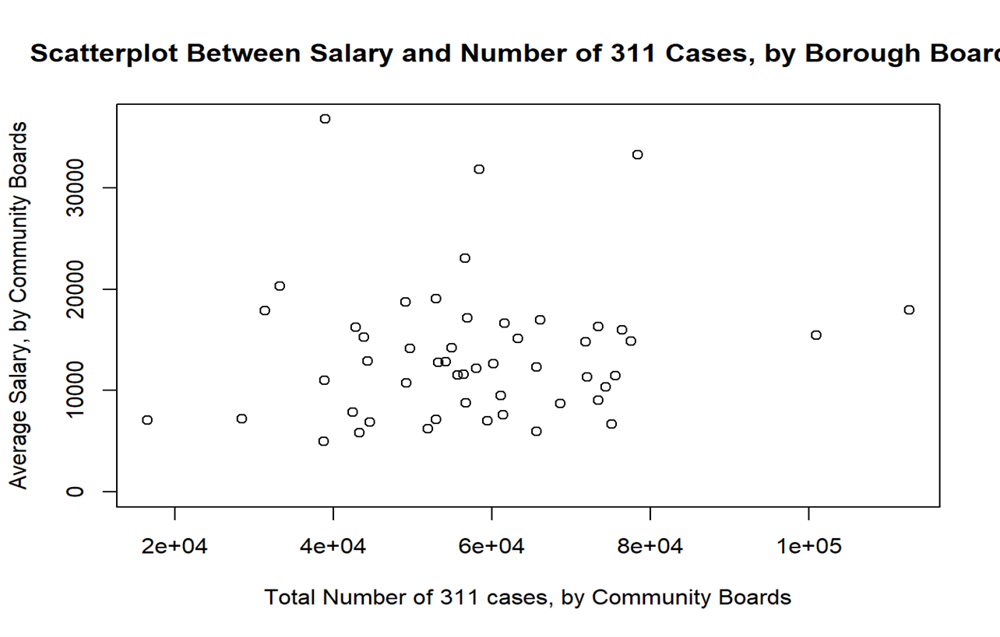

```{r setup, include=FALSE}
knitr::opts_chunk$set(echo = TRUE)
#general
library(tidyverse)
library(httr)
library(dplyr)
library(plyr)
library(gtools)
#for 311 data
library(RSocrata)

#pulling data
library(jsonlite)

#mapping libraries
library(tigris)
library(leaflet)
library(sp)
library(ggmap)
library(maptools)
library(broom)
library(rgdal)
library(lubridate)
```

### 311 data

This project mainly focused on two specific data sets provided by the city of New York. The first is a collection of 311 reports; similar to 911 calls, these are reports to the city about problems or issues that are not of immediate importance. These include pot holes or lights burnt out for example. The data comes from [NYC 311](https://www.ny.gov/agencies/nyc-311) and is published on [NYC OpenData](https://nycopendata.socrata.com/Social-Services/311-Service-Requests-from-2010-to-Present/erm2-nwe9).

The second data set we used to compare is the payroll information for all public employees in New York City. This dataset provides locations and various metrics about pay and employement related to individual employees in the city. The dataset can be found here: [NYC Payroll](https://data.cityofnewyork.us/City-Government/Citywide-Payroll-Data-Fiscal-Year-/k397-673e) dataset.

```{r API info, include=FALSE}
api_key <- "1x1syxa046asdu0rkk842sht5"
api_key_secret <- "3y8qpo8krd82vwnhxxjufuk8fv35tidgvc0gx2dhnbgeor1900"
token <- "ADRRlI3DDJge67NUzvmCG3vU3"
```


```{r Sample Data Pulls, eval=FALSE, include=FALSE}
#sample pull of 1 entry
#https://data.cityofnewyork.us/resource/erm2-nwe9.json?unique_key=10693408

#sample pull of 10
#df <- read.socrata(url = "https://data.cityofnewyork.us/resource/erm2-nwe9.json?$limit=10")
```


```{r 311 data pull, echo=FALSE}

# Call in NYC data for 2019
nyc <-  as_tibble(read.socrata("https://data.cityofnewyork.us/resource/fhrw-4uyv.json?$where=created_date between '2018-01-01T12:00:00' and '2018-12-31T23:59:59' and agency = 'NYPD'", app_token = token))

```

First we had to decide how to limit the set. We wanted to be able to make generalizations about the entire city of New York, so we didn't want to limit geographrically. A random sample might have worked over the decade, but instead we felt it was more representative to choose one complete year. We started with 2020, but then wanted to mitigate the effects of COVID as that was not something we wanted to research. So instead we choose 2018 as a date that should be unaffected and otherwise representative of a "normal" year. 

Dplyr was used to clean the data. Primarily this involved simple data cleaning; we converted numbers back to numbers rather than characters and removed the columns we felt were not helpful. 

```{r clean 311 data}
#clean the data
df_311 <- nyc %>% 
  mutate_at(vars(incident_zip, latitude, longitude, location_zip), as.numeric) %>% 
  select(-cross_street_1,-cross_street_2,-address_type,-facility_type,-due_date,-bbl,-x_coordinate_state_plane,-y_coordinate_state_plane,-park_facility_name,-park_borough,  -location_address,-location_state, -location_zip,-intersection_street_1,-intersection_street_2, -landmark,-bridge_highway_name,-bridge_highway_direction,-bridge_highway_segment,-road_ramp, -incident_address, -street_name, -location_city)
  
#glimpse(df_311)
```


### Salary Data


```{r Payroll data pull, echo=FALSE}
#select only 1 year
url_2018 <- "https://data.cityofnewyork.us/resource/k397-673e.json?fiscal_year=2019"

#create dataframe of payroll
df_payroll <- as_tibble(read.socrata(url_2018))

```

The same was done for the payroll dataset. However, we added an additional column here, which represented total pay for each employee as a sum of "regular pay, overtime pay and other pay." At first we didn't take a subset.

```{r cleaning payroll}
df_payroll_cleaned <- df_payroll %>%
  mutate_at(vars(fiscal_year,
         payroll_number,
         base_salary,
         ot_hours,
         regular_gross_paid,
         total_ot_paid,
         total_other_pay), as.numeric) %>% 
  mutate(total_pay = regular_gross_paid + total_ot_paid + total_other_pay)

```

One of the first intruiging points on the data set was agency start date. In effect, we could see when each employee began working for the city! This also helped in case there was a large amount stuck at 1900 for example. Here, it appears the most tenure employee began in the 1960's!

```{r echo=FALSE, warning=FALSE}
ggplot(df_payroll_cleaned, aes(x = year(agency_start_date))) + 
  geom_histogram(binwidth = 1) + 
  xlim(1960,2021)

```


### Exploring the data

Next, we thought it would be interesting to look at how 311 calls were made. I initally had assumed they were all phone calls, but in fact they weren't! Also reported is the location report type. For example, if there was a noise distrubance at a church, it would list a place of worship. Or if a playground set was broken, it would list a playground. Here, we chose to show the top 5.

```{r echo=FALSE, message=FALSE, warning=FALSE}
counts_of_start_type <- df_311 %>% 
  group_by(open_data_channel_type) %>% 
  dplyr::summarize(number_rows = n())

location_type_count <- df_311 %>% 
  group_by(location_type) %>% 
  dplyr::summarize(number_rows = n()) %>% 
  dplyr::arrange(decreasing = TRUE) %>% 
  top_n(5)
  
```

```{r echo=FALSE, message=FALSE, warning=FALSE}
ggplot(counts_of_start_type, aes(x = "", y = number_rows, fill = open_data_channel_type)) + 
  geom_bar(stat = "identity", width = 1, color="white") + 
  coord_polar("y", start = 0) + 
  theme_void() # remove background, grid, numeric labels

ggplot(location_type_count, aes(x = "", y = number_rows, fill = location_type)) + 
  geom_bar(stat = "identity", width = 1, color="white") + 
  coord_polar("y", start = 0) + 
  theme_void() + # remove background, grid, numeric labels 
  labs(title = "Top 5 location calls")
```


### Pay by department

Next in the exploration was asking who is paid the most and who is paid the least. We assume this is a rather normal question to ask with the payroll set. We assumed that the mayors office might be at top followed by high skilled or dangerous jobs such as firefighting or engineers for water or power. 

```{r echo=FALSE, message=FALSE, warning=FALSE}
pay_by_department<-df_payroll_cleaned %>% 
  group_by(agency_name) %>% 
  dplyr::summarise(Mean = mean(total_pay)) %>% 
  dplyr::arrange(decreasing = TRUE)

bottom_pay_by_department<-pay_by_department %>% 
  dplyr::arrange(desc(Mean)) %>% 
  top_n(-6) 
  
top_pay_by_department <- pay_by_department %>% 
  dplyr::arrange(desc(Mean)) %>% 
  top_n(6)  
  

extreme_pay<-bind_rows(top_pay_by_department, bottom_pay_by_department)


graph_pay<-ggplot(extreme_pay, aes(x = agency_name, y = Mean))+
  geom_bar(stat = "identity") + 
  ggtitle("Mean pay by agency (top and bottom 6)") + 
  coord_flip()

```
To our great surprise, most of the highest paid (by average) agencies were the various community boards! Around \$100,000, these were high average salaries. But on the other end of the spectrum, some community boards were among the lowest 5 agencies paid. Below is a summary of just community board pay throughout New York City. Especially surprising was that Bronx community boards were paid much higher than those in Manhattan for example. 

```{r echo=FALSE, warning=FALSE}
graph_pay
```
Here is a summary of the averages of only the community boards. The pay ranges from (on average) \$16,500 to over \$112,000! This is quite the gap!

```{r}
different_board_pay <- df_payroll_cleaned %>%
   dplyr::filter(grepl('COMMUNITY', agency_name)) %>% 
   dplyr::filter(!grepl('COLLEGE', agency_name)) %>% 
   dplyr::group_by(agency_name) %>% 
   dplyr::summarise(Mean = mean(total_pay)) 

summary(different_board_pay)

```


With this in mind, we thought it represented the perfect cross over between the two datasets. Both the payroll and the 311 dataset listed the community board that was responsible. 

First we should look at the distribution of 311 calls. We initially assumed they would be rather consistent between community board, with it more likely to have more calls in higher population areas. However, there was a lot of variance. Below is summary of the number of 311 calls by community board. 


```{r Summary of board pay, echo=FALSE, message=FALSE, warning=FALSE}
community_board_311 <- df_311 %>% 
  dplyr::group_by(community_board) %>% 
  dplyr::summarize(number_rows = n()) %>% 
  dplyr::arrange(desc(number_rows)) 
  
summary(community_board_311)
```

There is quite a range! Although not ideal for a bargraph, we graphed the various districts (or community boards) to see the variability, even though it is not possible to read the labels of which community is which. 


```{r Graph of 311s by district, echo=FALSE, message=FALSE, warning=FALSE}
cummunity_311s_graph <-ggplot(community_board_311, aes(x = community_board, y = number_rows))+
  geom_bar(stat = "identity") + 
  ggtitle("Mean pay by agency (top and bottom 6)") 

cummunity_311s_graph

```
Taking a closer look at the top and bottom contributors:

```{r echo=FALSE}
bottom_311s <-community_board_311 %>% 
  dplyr::arrange(desc(number_rows)) %>% 
  top_n(-4) 
  
top_311s <- community_board_311 %>% 
  dplyr::arrange(desc(number_rows)) %>% 
  top_n(4)  
  
extreme_311s <-bind_rows(bottom_311s, top_311s)

cummunity_311s_graph <-ggplot(extreme_311s, aes(x = community_board, y = number_rows))+
  geom_bar(stat = "identity") + 
  ggtitle("Mean pay by agency (top and bottom 6)") + 
  coord_flip()

cummunity_311s_graph
```

There is a wide disparity among 311's per community board! This is rather surprising, especially with how large of a jump there is. There are multiple districts with no 311s, in multiple boroughs, while others, including Manhattan have more than 30,000 in one calanedar year. However, the top contributing community board areas were not just Manhattan, but 3 different boroughs in just the top 4 results. 

### Does pay of community board effect responses?!

Clearly different community boards are paid very different amounts. Does this reflect their community and their involvement in making that area better? We would hope that the highest paid community boards had the best areas. This would be represented in their 311 response.  We can look at it :
- Amount of 311 calls (more is probably worse) as it represents problems
- Time between created and closed, or how long it takes to fix problems

```{r conversion and merger, echo=FALSE, message=FALSE, warning=FALSE}
#function that converts board names to payroll data format
dconverter <- function(x) {
  boardnumber <- unlist(regmatches(x, gregexpr("[1-9]+", x)))
  board_district <-
    unlist(regmatches(x, gregexpr("[BMQSU][a-zA-z]+", x)))
  if (board_district[1] == "STATEN") {
    newname <-
      paste(board_district,
            "ISLAND COMMUNITY BD",
            paste("#", boardnumber, sep = ""))
  }
  else{
    newname <-
      paste(board_district,
            "COMMUNITY BOARD",
            paste("#", boardnumber, sep = ""))
  }
  return(newname[1])
}

#example
#dconverter(levels(as.factor(df_311$community_board))[17])
#full conversion (current runtime ~1-2 min)
df_311$community_board_full <-
  laply(df_311$community_board, dconverter)
#duration, in minutes, of 311 cases
df_311$duration <-
  as.numeric((df_311$closed_date - df_311$created_date))
#get average duration by community board
durationavg <-
  t(as.data.frame(tapply(
    df_311$duration, df_311$community_board_full, mean
  )))
#get average pay by community board
payavg <-
  t(as.data.frame(
    tapply(
      df_payroll_cleaned$total_pay,
      df_payroll_cleaned$agency_name,
      mean
    )
  ))
#merge data
df_merged <- smartbind(durationavg, payavg)
df_merged <-
  as.data.frame(t(df_merged[, colSums(is.na(df_merged)) == 0]))
colnames(df_merged) <- c("Duration", "Salary")
#scatterplot between total pay and duration 


```

Below we can see a scatterplot between average salary and duration of cases. 

```{r scatterplot of total pay and duration, echo=FALSE, message=FALSE, warning=FALSE}

ggplot(df_merged,aes(x=Salary,y=Duration))+
  geom_point()+
  labs(title=paste("Scatterplot Between Average Salary and Duration of Cases","cor=",round(cor(df_merged$Salary,df_merged$Duration),2)))


```
The answer appears to be no. The vast majority of communities have a very similar average duration (100-500 minutes) regardless of mean pay. Then there are the 3 large outliers at the top. If we pretend the 3 high outliers aren't relevant (maybe these calls relate to things outside of the boards control, like bridges or times square for example):

```{r echo=FALSE}
ggplot(df_merged,aes(x=Salary,y=Duration))+
  geom_point()+
  labs(title=paste("Scatterplot Between Average Salary and Duration of Cases","cor=",round(cor(df_merged$Salary,df_merged$Duration),2))) +
  ylim(0,600) +
  geom_smooth(method = lm)
```

There is a slight positive line but with the low correlation we would say this is not incredibly meaningful.

### Algo, compare 1 district to the neighboring its neighboring. Does it predict?
```{r echo=FALSE, warning=FALSE}
#First idea, simple regression between salary (y) and number of 311 cases/average duration of 311 cases
community_board_311_amount <- df_311 %>% 
  dplyr::group_by(community_board_full) %>% 
  dplyr::summarize(number_rows = n()) %>% 
  dplyr::arrange(desc(number_rows))%>%
  t()
colnames(community_board_311_amount)<-community_board_311_amount[1,]
community_board_311_amount<-t(as.data.frame(community_board_311_amount[2,]))
df_merged_2<-t(df_merged)
df_merged_2<-smartbind(df_merged_2,community_board_311_amount)
rownames(df_merged_2)<-c(colnames(df_merged),"Total")
df_merged_2<-as.data.frame(t(df_merged_2))
df_merged_2[]<-lapply(df_merged_2,as.numeric)
#model1
lm1<-lm(Salary~Duration+Total,data=df_merged_2)
summary(lm1)
#plot(df_merged_2$Salary,df_merged_2$Total,main="Scatterplot Between Salary and Number of 311 Cases, by Borough Boards",
    # xlab="Total Number of 311 cases, by Community Boards",
   #  ylab="Average Salary, by Community Boards")

```


### Second idea, simple regression between total payroll budget for a given community board (y) and number of 311 cases/average duration of 311 cases for that community board

```{r message=FALSE, warning=FALSE, include=FALSE}
budget <-
  by(df_payroll_cleaned$total_pay,
     df_payroll_cleaned$agency_name,
     sum)
df_budget <- t(as.data.frame(do.call(rbind, as.list(budget))))
df_merged_3 <- as.data.frame(t(smartbind(t(df_merged_2), df_budget)))
colnames(df_merged_3) <- c(colnames(df_merged_2), "payrollbudget")


lm2 <- lm(payrollbudget ~ Duration + Total, data = df_merged_3)
summary(lm2)

ggplot(df_merged_3,aes(x=Total,y=payrollbudget))+
  geom_point()+
  labs(title=paste("Scatterplot Between Payroll Budget and Number of 311 Cases"))+
  ylim(0,(10^6)/4) + 
  geom_smooth(method = lm)

```



Finally what if we looked at more specificially only a certain position, in this case the "district manager" although there many be several on a community board. The pay difference in this case is far more dirastic! 

```{r echo=FALSE, message=FALSE, warning=FALSE}
only_boards_df <- df_payroll_cleaned %>%
   dplyr::filter(grepl('COMMUNITY', agency_name)) %>% 
   dplyr::filter(!grepl('COLLEGE', agency_name)) %>% 
   dplyr::filter(grepl('DISTRICT MANAGER', title_description))  

only_boards_merged <- as.data.frame(t(smartbind(t(only_boards_df), df_budget)))
colnames(df_merged_3) <- c(colnames(df_merged_2), "payrollbudget")

summary(only_boards_df$total_pay)
```
So as one final chance, lets try grouping these by district and see if there is a stronger result. This removes smaller positions that likely have little impact. 

#### Engineered feature
As such, the most helpful feature that we engineered was a column of the data that was the overall payroll budget for each community board. Because commmunity boards consist of paid, nonpaid and nonsalaried individuals, it was helpful to be able to have a feature that directly told us the overall budget that board had to distribute. This feature was almost more helpful than just taking averages of gross pay for example as it helped us better categorize efficient community boards. For example, a theoretically corrupt board could make a bunch of their nonsalaried members salaried, just for a very low amount of money which would drop the average. Here, we can just look at the money given to them directly from the city level. 

```{r echo=FALSE, message=FALSE, warning=FALSE}

only_boards_df <- df_payroll_cleaned %>%
   dplyr::filter(grepl('COMMUNITY', agency_name)) %>% 
   dplyr::filter(!grepl('COLLEGE', agency_name)) %>% 
   dplyr::filter(grepl('DISTRICT MANAGER', title_description))  %>% 
   dplyr::group_by(agency_name) %>% 
   dplyr::summarise(Mean = mean(total_pay))

summary(only_boards_df)


payroll_budget <- df_merged_3 %>% 
  tibble::rownames_to_column() %>% 
  dplyr::filter(grepl('COMMUNITY', rowname)) %>% 
  dplyr::filter(!grepl('COLLEGE', rowname)) %>% 
  dplyr::group_by(rowname) %>% 
  dplyr::select(rowname, payrollbudget) 


colnames(payroll_budget) <- c("agency_name", "payroll_budget")
  
managers_and_budget <- merge(payroll_budget, only_boards_df)

lm_payroll_to_district_manager <- lm(payroll_budget ~ Mean, data = managers_and_budget)
summary(lm_payroll_to_district_manager)

ggplot(data = lm_payroll_to_district_manager, mapping = aes(x = payroll_budget, y = Mean)) + 
  geom_point() + 
  geom_smooth(method = lm)
```

This is rather obvious. The larger the budget, the more the district managers are paid. 

### Do these findings make practical sense?

After further research, the answer appears to be yes. The individual salaries of borough presidents or district managers are unlikely to have an affect on the overall response that the community board makes. Why? 

The 59 community boards of NYC each consist of 50 nonsalaried members who are nominated by their district's City Council members. These volunteer type positions make up the vast majority of the human power in each community board. While each District Manager establishes an office and can hire staff, many times these nonsalaried members appear to be the ones that truly care about the community and are excited to make a change. 

In fact, there are strict limits on the amount of board members that are employees of New York City (no more than 25 \%). In this sense, the data that we have available to use shows that these salaried employees likely have a very small impact on the number of 311s and the effective response that that community has. 

Links for more reading:
[Manhattan Borough President](https://www.manhattanbp.nyc.gov/communityboards/)
[NYC Government description of roles](https://www.manhattanbp.nyc.gov/communityboards/)
[Laws about the community boards and their responsibilities](http://www.cb3qn.nyc.gov/1653)
